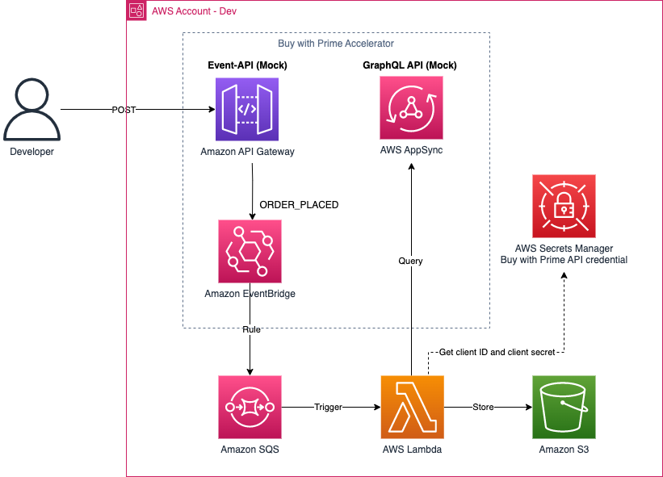

# Enterprise Event Accelerator 

This CDK package shows an example of utilizing Buy with Prime's Order event and API. This package is based on the **Mock API and Mock Event**, not the Buy with Prime production API, or production Event. If you do not have a Buy with Prime Accelerator to generate Mock APIs and Mock Events, please request one from your Buy with Prime SA. If you don't have point of contact, please reach out to BwP-feedback@amazon.com.   

This sample demonstrates an example of extracting an `orderId` from a mock order events, and using that ID to call the Buy with Prime Mock API to query information about a single order. You can see the Buy with Prime query example in [`app/singleOrder.graphql`](app/singleOrder.graphql) and it's [sample query response](query_response/index.md). This sample code stores the response in a format of text file. You can see the actual example from [sample object.](sample_object/2023-09-01%2005_36_23)

## Prerequisite
1. Deploy Buy with Prime accelerator in your AWS account. 
2. Prepare your S3 bucket to store Buy with Prime data. 

## Architecture

- AWS Secrets Manager
- Amazon EventBridge
- Amazon SQS and Dead Letter Queue
- AWS Lambda
- Amazon S3

The lambda function hydrates Buy with Prime events, parsing `orderId`, sends `order` query as written in `singleOrder.graphql`. You can edit the file by eliminating unnecessary fields, or replace with other GraphQL queries/mutations. If you want to know each field of order query, or other APIs, please find [Buy with Prime API reference.](https://documents.partners.buywithprime.amazon.com/private/page/api-reference)

- Extract `order_id` from the event payload 
- Call `order` with the `order_id` to get all information of a single order.  
- Store the response in S3 in the format of timestamp. 

## How to install
1. Clone this repository.
2. Create a file named `.env` to set up the environment variables. It requires you to have the following fields.
    - `S3_BUCKET_ARN` - Create a S3 bucket for this sample and put the bucket name. e.g. "arn:aws:s3:::YOUR_BUCKET"
    - `EVENT_BUS_ARN` - your Buy with Prime Accelerator's EventBridge ARN.
    - `MOCK_BWP_API` - your Buy with Prime Accelerator's Appsync endpoint. 
    - `AWS_REGION` - Your AWS region. 
    - (Optional) `CLIENT_ID` and `CLIENT_SECRET`: When you have your client ID after onboarding process completed.  
3. Run cdk commands.
```
npm i
cdk bootstrap
cdk deploy
```
## How to generate order events
- order events: `ORDER_PLACED`, `ORDER_UPDATED`, `REFUND_SUCCESS`.

```
curl --location --request POST '{YOUR_BUY_WITH_PRIME_ACCELERATOR_ORDER_API/prod}/put-event/order?event-type=order_placed'
```

## Amazon EventBridge event pattern examples
The default rule in this CDK package creat a rule to foward all events through Amazon EventBridge to Amazon SQS target. 
```
      eventPattern: {
        source: [{prefix: ""}] as any[] // All events
      }
```

You can configure a custom rule to forward the events to different targets.

The CDK has sample event pattern to filter Buy with Prime event types. You can update the rules in `lib/cdk-stack.ts`.

```
    eventPattern: {
    "detail": {
        "eventType": ["REFUND_SUCCESS"]
    }
    },
```

```
    eventPattern: {
    "detail": {
        "eventType": ["ORDER_PLACED", "ORDER_UPDATED"]
    }
    },
```
## Out of scope
- This sample code is designed based on Buy with Prime Accelerator, not using neither production events or APIs. 
- Buy with Prime Accelerator uses static token, so this sample does not contain authentication logic to store or refresh tokens. 

## References
- [Buy with Prime API reference](https://documents.partners.buywithprime.amazon.com/private/page/api-reference)
- [Buy with Prime Event Integration Guide](https://documents.partners.buywithprime.amazon.com/private/docs/buy-with-prime-event-integration-guide)

## Security

See [CONTRIBUTING](CONTRIBUTING.md#security-issue-notifications) for more information.

## License

This library is licensed under the MIT-0 License. See the LICENSE file.

