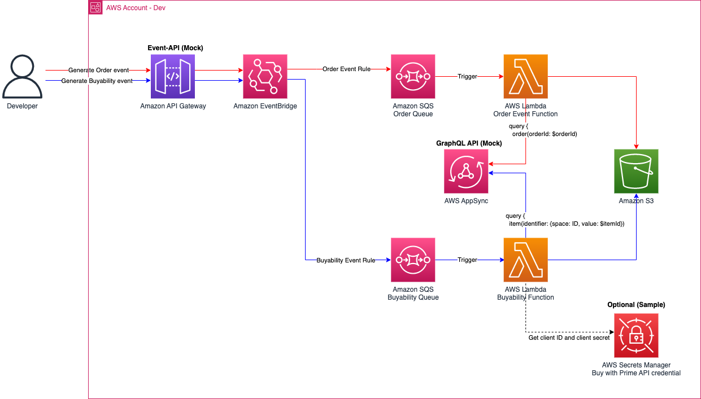

# Enterprise Event Accelerator 

This CDK package shows an example of utilizing Buy with Prime's events and API. This package is based on the **Mock API and Mock events**, not the Buy with Prime production API, or production events. If you do not have a Buy with Prime Accelerator to generate Mock APIs and Mock Events, please request one from your Buy with Prime SA. If you don't have point of contact, please reach out to BwP-feedback@amazon.com.   

This sample demonstrates an example of event hydration for:
- **order event** : `ORDER_PLACED`, `ORDER_UPDATED`, `REFUND_SUCCESS`.
- **buyability and inventory event** 

## Order event
The order event stack extracts an `orderId` from a mock order event. Using that ID, the stack calls the Buy with Prime Mock API to query information about a single order. You can see the Buy with Prime query example in [`singleOrder.graphql`](app/order/singleOrder.graphql) and it's [sample query response](query_response/queryOrder.md). This sample code stores the response in a format of text file. You can see the actual example from [sample object.](sample_object)

## Buyability event
- Inventory event: Work in Progress.
The event hydrator checks if the event has `identifierType` as an `itemId`. If so, it extracts `identifierValue`, which is a unique `itemId`. Using that ID, the Lambda function sends the item query to the Buy with Prime Mock API. You can see the item query in [`itemByID.graphql`](app/buyability/itemByID.graphql) and it's [sample query response.](query_response/itemByID.md)

## Prerequisite
1. Deploy Buy with Prime accelerator in your AWS account. 
2. Prepare your S3 bucket to store Buy with Prime data. 

## Architecture

- AWS Secrets Manager
- Amazon EventBridge
- Amazon SQS and Dead Letter Queue
- AWS Lambda
- Amazon S3

The lambda function hydrates Buy with Prime events, parsing `orderId`, sends `order` query as written in `singleOrder.graphql`. You can edit the file by eliminating unnecessary fields, or replace with other GraphQL queries/mutations. If you want to know each field of order query, or other APIs, please find [Buy with Prime API reference.](https://documents.partners.buywithprime.amazon.com/private/page/api-reference)

- Extract `order_id` from the event payload 
- Call `order` with the `order_id` to get all information of a single order.  
- Store the response in S3 in the format of timestamp. 

## How to install
1. Clone this repository.
2. Update `.env`
    - `CLIENT_ID` and `CLIENT_SECRET`: When you have your client ID after onboarding process completed. (Optional)  
    - `S3_BUCKET_ARN` 
    - `EVENT_BUS_ARN` - your Buy with Prime Accelerator's EventBridge ARN.
    - `MOCK_BWP_API` - your Buy with Prime Accelerator's Appsync endpoint. 
    - `AWS_REGION` - Your AWS region. 
3. Run cdk commands.
```
cdk bootstrap
cdk deploy
```
## How to generate Mock events
You can generate a mock Buy with Prime event by calling Buy with Prime accelerator's event API. The mock event API endpoint can be found in the Amazon API Gateway under the name `Event-api`.
### order events
- `ORDER_PLACED`, `ORDER_UPDATED`, `REFUND_SUCCESS`.

```
curl --location --request POST '{Mock_Event_API_endpoint/prod}/put-event/order?event-type=order_placed'

curl --location --request POST '{Mock_Event_API_endpoint/prod}/put-event/order?event-type=order_updated'

curl --location --request POST '{Mock_Event_API_endpoint/prod}/put-event/order?event-type=order_refund_success'
```
### Buyability event
```
curl --location --request POST '{Mock_Event_API_endpoint/prod}/put-event/buyability?event-type=buyability'
```

## Amazon EventBridge event patterns

This event accelerator has two custom rules to forward events to different targets based on the event types.

The CDK has sample event pattern to filter Buy with Prime event types. You can update the rules in `lib/cdk-stack.ts`.

### Order event rule
```
    eventPattern: {
    "detail": {
        "eventType": ["ORDER_PLACED", "ORDER_UPDATED", "REFUND_SUCCESS"]
    }
    },
```

### Buyability event rule 
```
    eventPattern: {
    "detailType": ["santos.buyability.status.change"]
    },
```

## GraphQL Error Handling

Unlike REST, GraphQL will return a response with code `200`, regardless of whether or not there was an error in the call. A `200` in GraphQL simply means that the endpoint is available and you successfully made a call. Instead of using specific error codes, GraphQL reports errors by adding error blocks. This allows for much more granual error reporting than generic response codes. For more on Errors in GraphQL, see [the GraphQL spec documentation here.](https://spec.graphql.org/October2021/#sec-Errors)

This Event accelerator is designed to handle GraphQL errors in these scenarios:

- The response status is not 200. This means the endpoint is not available
- The response body contains an "errors" section. This means the call was sent successfully, but there was an error during execution

```
    ...
    if response.status != 200 or 'errors' in str(response_data): // detect errors
        print("response", response.status, response_text)
    else:
        ...
```

This is an example response to an Order query when the  Order object doesn't exist. The HTTP response status would still be 200. However, the body of the response contains details of the errors. You should consider these cases when building out your GraphQL error handling.

```
response 200 
{
    "data": {
        "order": null
    },
    "errors": [
        {
            "path": [
                "order"
            ],
            "data": null,
            "errorType": "MappingTemplate",
            "errorInfo": null,
            "locations": [
                {
                    "line": 2,
                    "column": 3,
                    "sourceName": null
                }
            ],
            "message": "Template transformation yielded an empty response."
        }
    ]
}
```
Of course, you should also consider errors where the code is not 200. Find more information about errors by code in [Buy with prime GraphQL API error codes.](https://documents.partners.buywithprime.amazon.com/private/docs/buy-with-prime-graphql-api-error-codes)

## Out of scope
- This sample code is designed based on Buy with Prime Accelerator, not using neither production events or APIs. 
- Buy with Prime Accelerator uses static token, so this sample does not contain authentication logic to store or refresh tokens. 

## Clean up
By running cdk command, you can clear most of the resources.
```
cdk destroy
```
However, you need to manually delete these resources.
- Amazon S3 bucket: If the bucket is not empty, `cdk destroy` cannot delete the bucket. You need to empty the bucket before running `cdk destory`, or manually delete the bucket.
- AWS Lambda Log groups: The CDK stack sets the log retention period to one month. If you want to delete a log group before this period, you can delete the log group manually. Go to Amazon CloudWatch > Logs > Log groups and filter for `EventAcceleratorStack` to find the log group.
## References
- [Buy with Prime API reference](https://documents.partners.buywithprime.amazon.com/private/page/api-reference)
- [Buy with Prime Event Integration Guide](https://documents.partners.buywithprime.amazon.com/private/docs/buy-with-prime-event-integration-guide)
- [Buy with prime GraphQL API error codes](https://documents.partners.buywithprime.amazon.com/private/docs/buy-with-prime-graphql-api-error-codes)